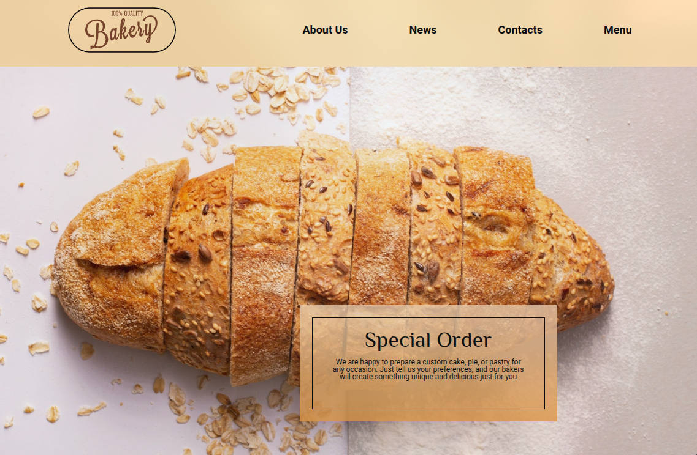

# 🥐 Landing Page - Bakery Shop

Учебный лендинг для пекарни. Первый проект - фокус на освоении базовой HTML-структуры, БЭМ-методологии и SCSS

---

## 🚀 Функционал

- Шапка сайта с логотипом и навигационным меню
- Hero-секция с фоновым изображением и карточкой спецзаказа
- Секция описания с иконками и текстовым блоком
- Секция заказа с встроенной Google Maps
- Футер с повторной навигацией
- Базовая БЭМ-структура классов

---

## 🛠 Стек технологий

- HTML5
- CSS3 / SCSS
- Методология: BEM
- Flexbox
- Git & GitHub

---

## 📸 Скриншоты



---

## ⚙️ Запуск проекта

```bash
git clone https://github.com/xamiuez/landing-bakery-shop.git
cd landing-bakery-shop
```

**открыть `src/index.html` в браузере**
